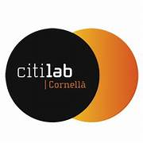

# Mecanismes-STEMFIE---Citilab

Sistemes de mecanismes per la transformació del moviment utilitzant el sistema de construcció Stemfie

STEMFIE es un projecte de construcció lliure, que s'imprimeix en 3D (http://stemfie.org) 

Aquest projecte ha estat realitzat pel [Citilab](https://www.citilab.eu/)    

Pretén estudiar el moviments mitjançant diferents mecanismes i sota el control d'una placa educativa ED1 dissenyada en el Citilab.

Tota la [documentació es pot trobar en PDF](https://github.com/maynej/Mecanismes-STEMFIE---Citilab/tree/main/Doc). També en castellà i anglés.

STL per imprimir [aquí](https://github.com/maynej/Mecanismes-STEMFIE---Citilab/tree/main/STL).

## Suports 3D
  
Descripció         | Imatge          | Arxius STL         
------------- | ------------- | ------------- 
Suport Arduino Nano i tapa | | [Arduino Nano](CPU/ArduinoNanoStemfie.stl), [Arduino Nano 2](CPU/ArduinoNano2Stemfie.stl), [Tapa Arduino Nano](CPU/TapaArduinoNanoStemfie.stl)
Suport Bateria Li-ion 18650| | [18650](CPU/18650Holder2Stemfie.stl)

## Llicència

Creative Commons Attribution-NoComercial-ShareAlike 4.0 International (CC BY-NC-SA 4.0)  

## QR

 <a href="https://www.codigos-qr.com/en/qr-code-generator/" target="_blank" id"qrgenerator">Qr Code Generator</a>

