# Mecanismes-STEMFIE---Citilab

Sistemes de mecanismes per la transformació del moviment utilitzant el sistema de construcció Stemfie

STEMFIE es un projecte de construcció lliure, que s'imprimeix en 3D (http://stemfie.org) 

Aquest projecte ha estat realitzat pel [Citilab](https://www.citilab.eu/)    

Pretén estudiar el moviments mitjançant diferents mecanismes i sota el control d'una placa educativa ED1 dissenyada en el Citilab.

## Lleva 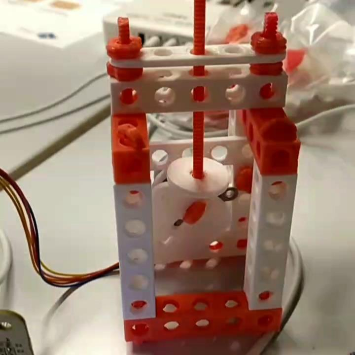  Engranatge 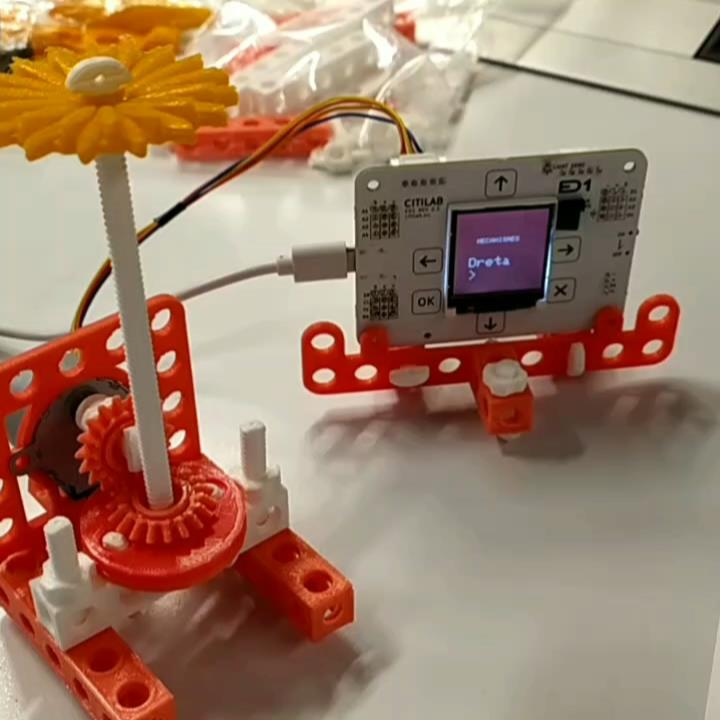 
## Biela Manovella 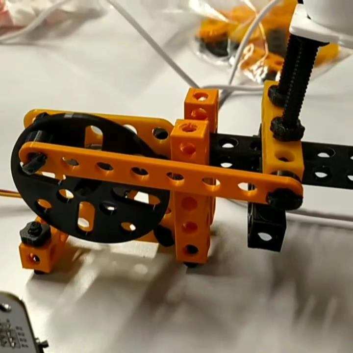

[Videos] (https://github.com/maynej/Mecanismes-STEMFIE---Citilab/tree/main/Videos)

Tota la [documentació es pot trobar en PDF](https://github.com/maynej/Mecanismes-STEMFIE---Citilab/tree/main/Doc). També en castellà i anglés.

STL per imprimir [aquí](https://github.com/maynej/Mecanismes-STEMFIE---Citilab/tree/main/STL).

## Suports 3D
  
Descripció         | Imatge          | Arxius STL         
------------- | ------------- | ------------- 
Engranatges |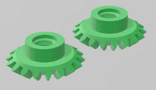 | [Engrenatges](STL/Engranatges.stl)
Kit 1 |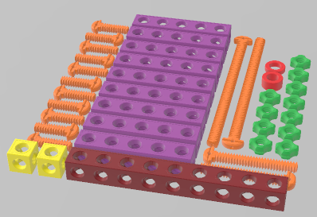 | [Kit 1](STL/STEMFIE-kit1.stl)
Kit 2 |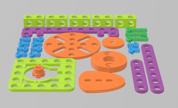 | [Kit 2](STL/STEMFIE-kit2.stl)
Eines |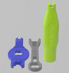 | [Eines](STL/STEMFIE-tools.stl)
Gallina |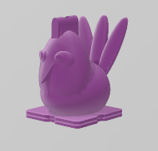 | [Gallina](STL/gallina.stl)
Conill |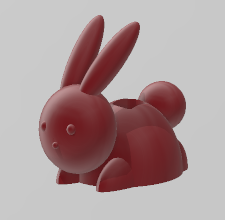 | [Conill](STL/conill.stl)
Dofí |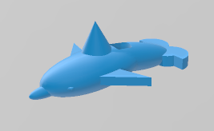 | [Dofí](STL/dofi.stl)
Flor |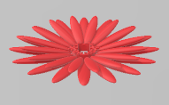 | [Flor](STL/flor.stl)
Abella |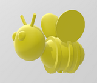 | [Abella](STL/abella.stl)

## Llicència

Creative Commons Attribution-NoComercial-ShareAlike 4.0 International (CC BY-NC-SA 4.0)  

## QR

 <a href="https://www.codigos-qr.com/en/qr-code-generator/" target="_blank" id"qrgenerator">Qr Code Generator</a>

